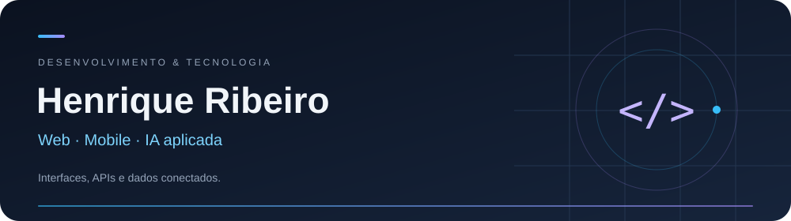
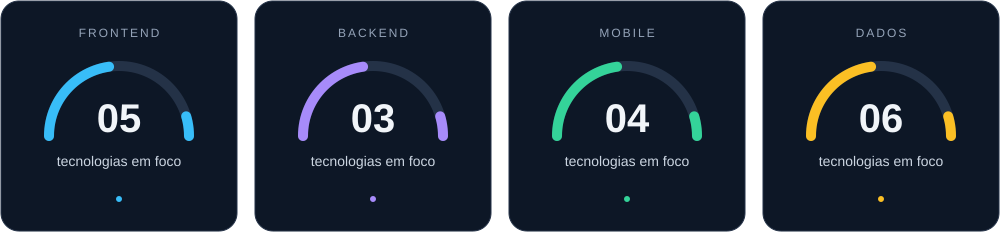

 

## Sobre mim

Sou Henrique Ribeiro, desenvolvedor no Brasil. Meu foco está em conectar **interfaces, APIs e dados**, passando por aplicações web, mobile e integrações com inteligência artificial.

Exploro arquitetura de software, autenticação, visualização de dados e integração entre serviços. Também estudo concorrência e sincronização de threads com Java.

## Linguagens

**TypeScript · JavaScript · Dart · Kotlin · Java**  
HTML · CSS · SCSS

## Meu universo de tecnologias

Os indicadores contam as tecnologias destacadas abaixo em cada área; não representam percentuais de proficiência.

### Frontend

**React · Next.js · Vite · Tailwind CSS · Material UI · shadcn/ui · Framer Motion**

Componentes reutilizáveis, interfaces responsivas, navegação, animações e internacionalização.

### Backend

**Node.js · NestJS · Express**

APIs, autenticação com JWT, validação de dados e integração entre serviços.

### Mobile

**Flutter · Android · GetX · Provider**

Aplicativos multiplataforma, gerenciamento de estado, notificações e integração com recursos do dispositivo.

### Dados

**MongoDB · Oracle · SQLite · Firebase · Firestore · Qdrant**

Bancos relacionais, documentos, serviços em nuvem e armazenamento vetorial.

## IA e visualização de dados

- **IA aplicada:** Ollama, llama.cpp e integração com Gemini.
- **Áudio:** integração com Google Cloud Speech para transcrição.
- **Dashboards e gráficos:** Recharts e fl_chart.
- **Interações e movimento:** Framer Motion e animações CSS.

## Arquitetura e ferramentas

**Clean Architecture · Monorepos · OpenAPI · Zod**  
Docker · Git · pnpm workspaces · Jest · Supertest · Playwright

---

**Vamos conectar ideias e construir algo útil.**

[Converse comigo no LinkedIn](https://www.linkedin.com/in/henriquerib/)

